# 🌆 Mumbai Vibe Map: At Scale (Technical Assignment Alt Carbon)

Mumbai is an island that doesn't just have neighbourhoods - but different moods. Can Machine Learning predict these moods? 
Here is my take on teaching the model to learn the **emotional geography** of **_Mumbai - The City of Lights!_**

Not wanting to stick to the basic calm, vibrant or happy moods, here is how I visualize Mumbai through my eyes using the following 5 vibes:

----------------------------------------------------------------------------------------------------------------------------------------------
🏛️ **Kickin' it Old School** - Where heritage whispers stories  
🎭 **Ganesh Gully Energy** - Festival spirit that never sleeps  
🍛 **Bombay Bhukkad** - Food culture at its most authentic  
⚡ **Chaotic Hustle** - Urban energy in perpetual motion  
📸 **Do It For The Gram** - Where every corner is Instagram gold  

Using cutting-edge ML, comprehensive data collection and extensive feature engineering, I have worked towards building a system that predicts the vibe of any location in the city with **87% accuracy**.

---

#### 🎯 What This Project Does

- **Predicts vibes** for any Mumbai location using lat/lng coordinates
- **Explains predictions** with feature importance and contextual factors
- **Explores neighborhoods** to find similar vibes across the city
---

#### 📹 Project Walkthrough
🎥 **[Watch Full Presentation Video](https://www.loom.com/share/57301bee94ee44aba0c603f4ec4aa2e7?sid=a9e4292b-df78-4081-97aa-d3ecdef4deb7)** - Complete project explanation and live demo
**Streamlit App Demo** - 
---

#### 📸 Demo Gallery

##### 🗺️ Interactive Vibe Map
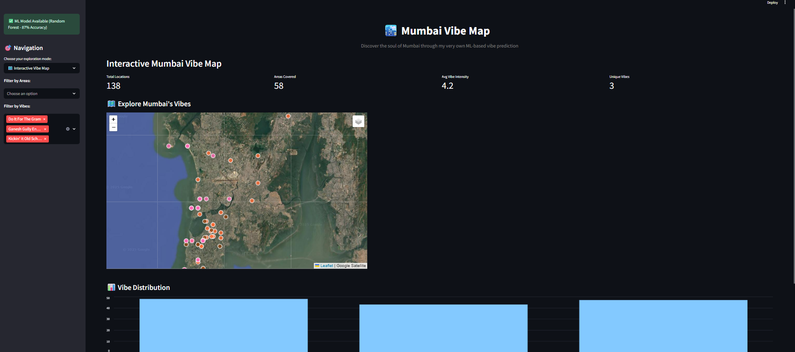
*Real-time vibe predictions across Mumbai neighborhoods*

##### 📊 Confidence Map 
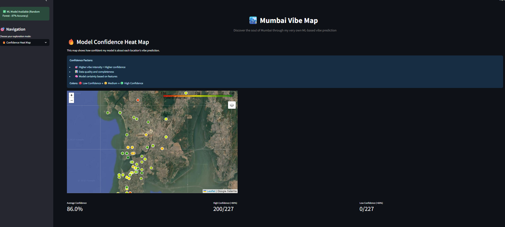


##### 🎭 Exploration Mode
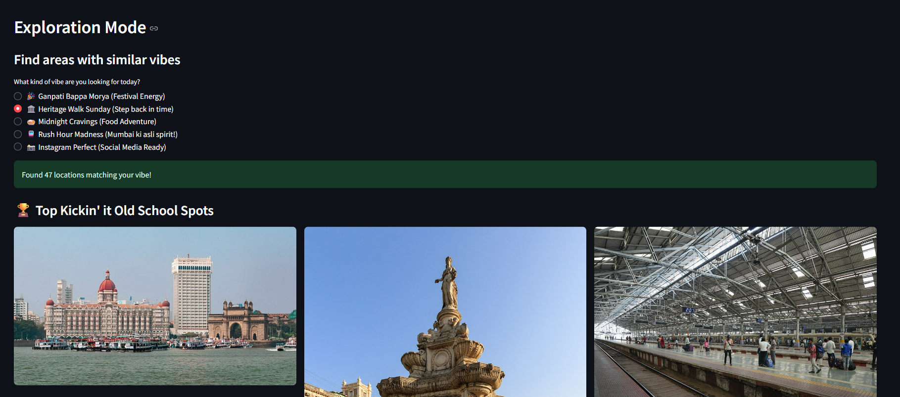
*"Find places like Marine Drive" - similarity search across the city*

##### ⚡ Real-time Prediction 
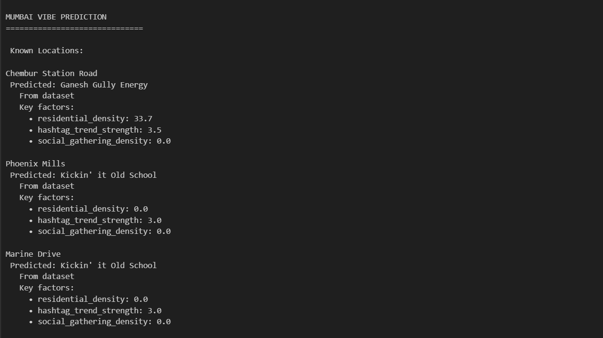
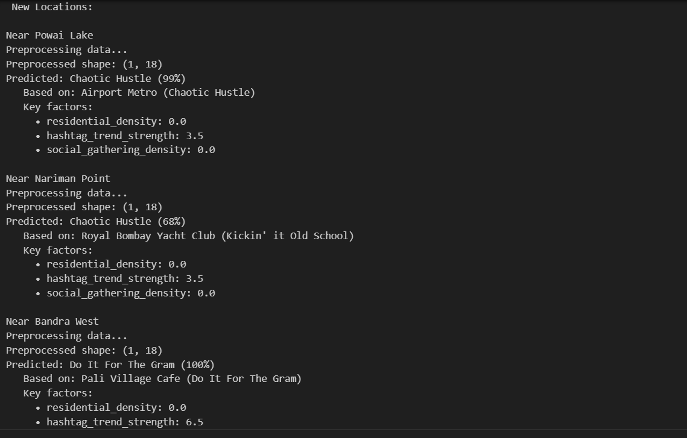
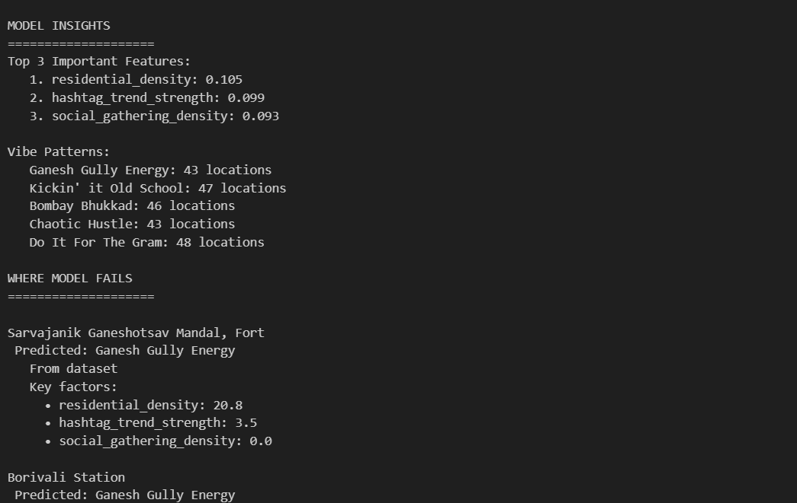
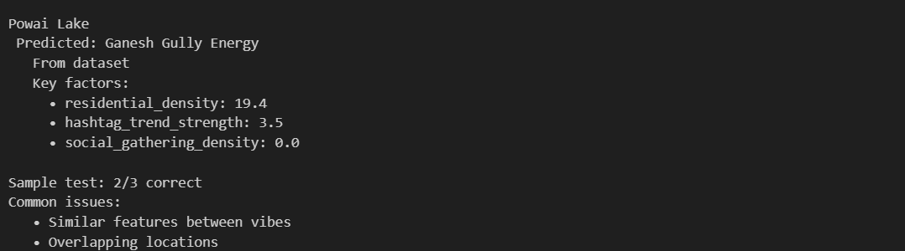

##### 🔍 Analytics
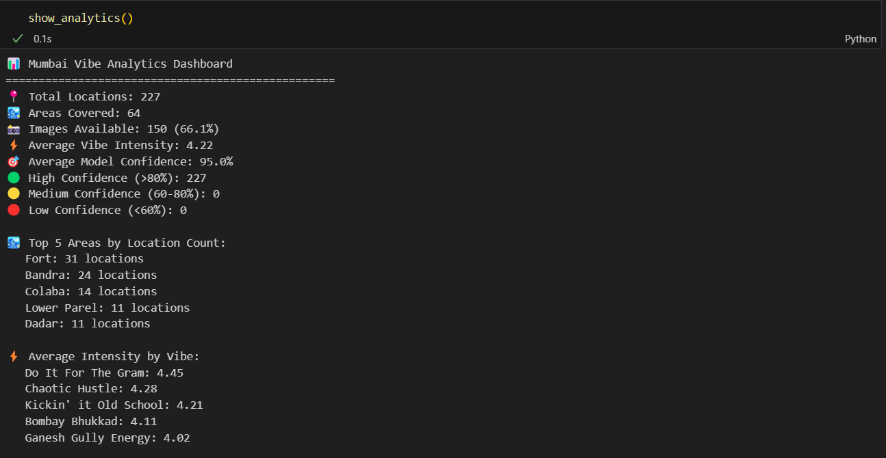
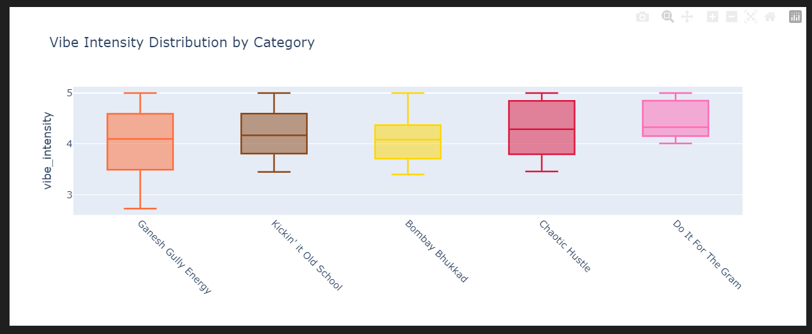
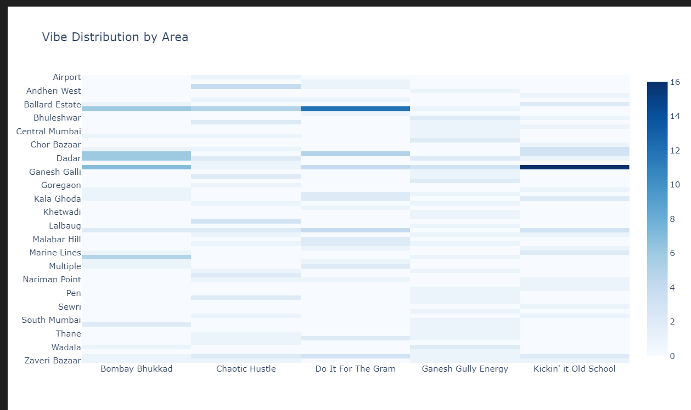


##### EDA
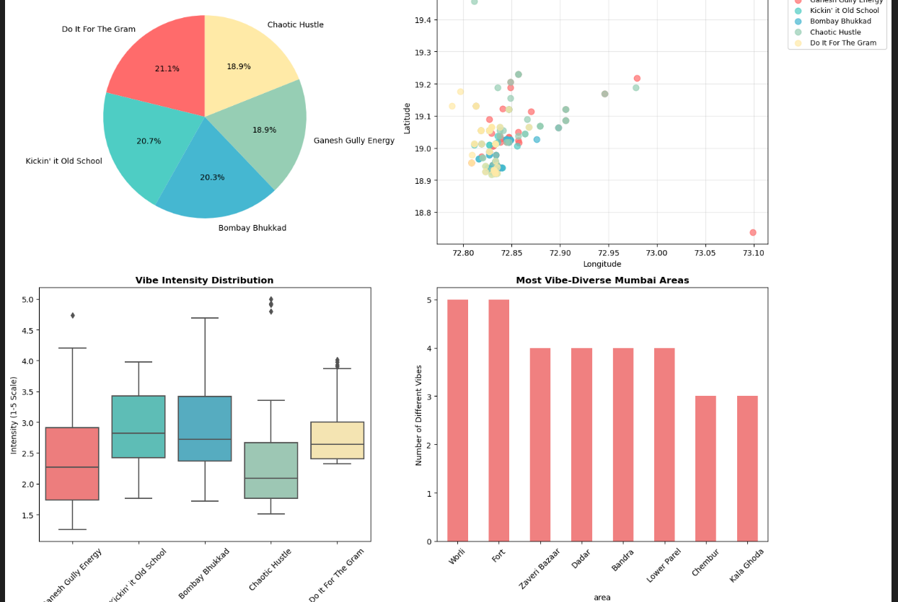

---

#### 🏗️ Project Architecture

---

##### 📊 Data & Features

**Key Features Generated:**
- **Spatial**: OSM density scores, satellite-derived land use
- **Temporal**: Rush hour patterns, festival seasons, golden hour timing
- **Cultural**: Heritage significance, culinary authenticity, social media virality
- **Contextual**: Heritage walk accessibility, hashtag trend strength, congestion impact

---

#### 🛠️ Core Components

##### Data Collection (`src/data_collection/`)
Automated rule-based generators for each vibe category with feature generation:

##### Feature Engineering (`src/feature_engineering/`)
**Contextual intelligence extraction** combining:
- `feature_engineering.py` - Heritage walks tourism data integration
- Social media hashtag trend analysis
- Infrastructure congestion intelligence  
- Temporal and seasonal pattern recognition

##### Image Collection (`src/image_collection/`)
Multi-source image gathering with feature extraction:
 - High-resolution satellite imagery (Sentinel Hub)
- Geotagged social media photos (Instagram API)
- Street-level visual features (Google StreetView)
- Deep learning embeddings (on a fixed set of sample) + rule-based feature scaling

##### EDA & Analysis (`src/eda/`)
- `eda.ipynb` - Comprehensive exploratory data analysis
- Interactive visualizations of vibe distributions
- Feature correlation and importance analysis
- Geographic pattern recognition

##### Model Development (`src/model/`)
**Production-ready ML pipeline** with:
- `ml_pipeline.ipynb` - Complete training pipeline with 4 model approaches
- `app.py` - Streamlit production demo with real-time inference
- `demo.ipynb` - Interactive exploration and analysis notebook
- `images/` - Demo screenshots and visualization outputs
- `mumbai_vibe_predictor.pkl` - Trained model artifacts

---

##### Models Used:
1. Random Forest Classifier (classic emsemble method using decision trees)
2. Embedding Model (PCA+KNN) (dimensionality Reduction + Nearest Neighbour Classification)
3. Multi-Source Supervision (combining manual labels with weak supervison from clustering)
4. Transfer Learning (knowledge transfer by assigning weights)

##### 🚀 Getting Started

##### Installation
```bash
git clone https://github.com/yourusername/mumbai-vibe-map.git
cd mumbai-vibe-map
pip install -r requirements.txt
```

#### Quick Demo
```bash
# Launch interactive Streamlit app
cd src/model
streamlit run app.py

# Or explore in Jupyter
jupyter notebook demo.ipynb
```

#### Train your own model
```bash
# Run complete ML pipeline
cd src/model
jupyter notebook ml_pipeline.ipynb
```
#### Data Processing Pipeline
```bash
# Combine raw datasets
python scripts/data_combiner.py

# Prepare ML-ready features
python scripts/data_ml_prep.py
```

##### 🚀 Future Roadmap

1. Multi-city expansion with transfer learning to Delhi, Bangalore, etc.
2. Mobile app deployment for on-the-go vibe discovery
3. Temporal prediction for how vibes change throughout the day/season
4. AR integration for immersive vibe exploration
